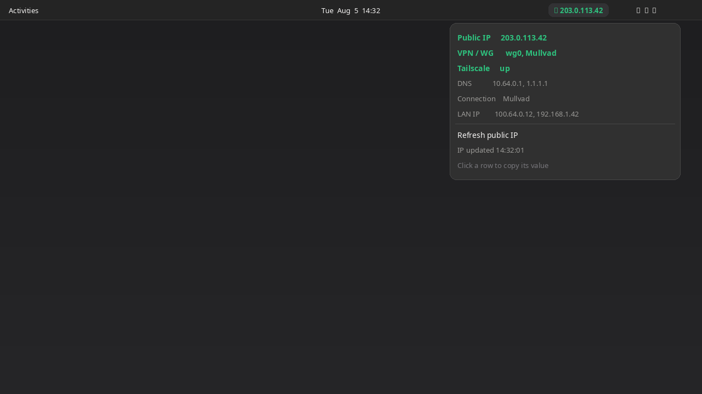

# Net Identity

GNOME Shell extension: top-panel **network identity** indicator (public IP, VPN/WireGuard/Tailscale, DNS, LAN).



## Features

- Public IP in the panel (auto-refresh every 5 minutes)
- VPN / WireGuard name detection via NetworkManager
- Tailscale up/down (connection name or `tailscale0`)
- DNS resolvers (NM, with `/etc/resolv.conf` fallback)
- Primary connection and LAN addresses
- Click a menu row to copy its value
- Desktop notification when the public IP changes

## Requirements

- GNOME Shell **45–50**
- NetworkManager
- Network access for optional public-IP lookup

## Install

```bash
UUID=net-identity@n0l0g1c.github.io
mkdir -p ~/.local/share/gnome-shell/extensions
cp -a "$UUID" ~/.local/share/gnome-shell/extensions/
gnome-extensions enable "$UUID"
```

Log out/in on Wayland (or restart GNOME Shell) so the extension is discovered.

## Network use

When refreshing the public IP, the extension may contact one of:

- `https://api.ipify.org`
- `https://ifconfig.me/ip`
- `https://icanhazip.com`

Responses are kept in memory for the session only. Local identity data comes from NetworkManager and `/etc/resolv.conf`. No accounts and no telemetry.

## Screenshots

| File | Contents |
|---|---|
| [`screenshots/screenshot.png`](screenshots/screenshot.png) | Primary store image — VPN up |
| [`screenshots/screenshot-no-vpn.png`](screenshots/screenshot-no-vpn.png) | Public network, VPN down |
| [`screenshots/icon.png`](screenshots/icon.png) | Optional icon asset |

## Packaging

```bash
./pack.sh
# → net-identity@n0l0g1c.github.io.shell-extension.zip
```

Zip contents: `metadata.json`, `extension.js`, `stylesheet.css`, `LICENSE`.

This project follows the [GNOME Shell extension review guidelines](https://gjs.guide/extensions/review-guidelines/review-guidelines.html) (lifecycle cleanup, GPL-2.0-or-later, network use disclosed in metadata, no telemetry).

## Development

```bash
cp -a net-identity@n0l0g1c.github.io \
  ~/.local/share/gnome-shell/extensions/
journalctl -f /usr/bin/gnome-shell
```

## License

[GPL-2.0-or-later](LICENSE)

## Author

[N0L0g1c](https://github.com/N0L0g1c)
